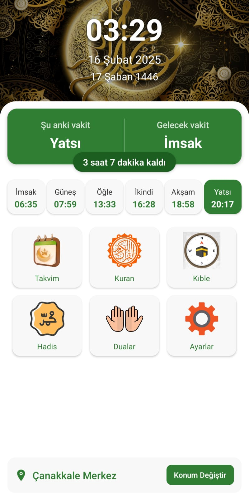
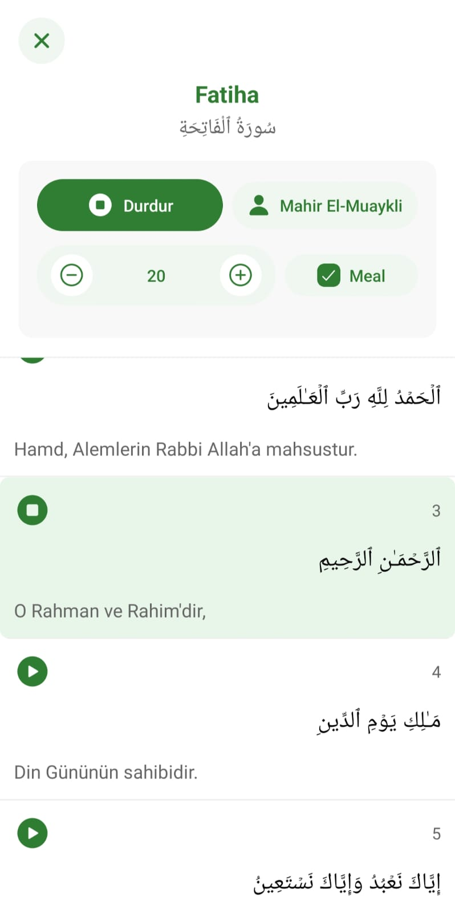
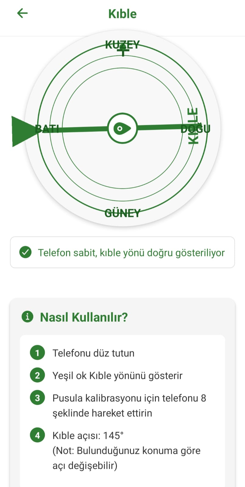
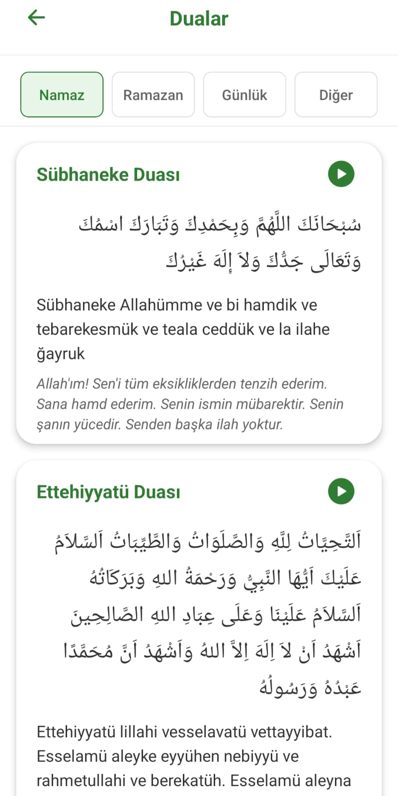

# RAMAZAN 2025 MOBİL UYGULAMASI

Bu uygulama, Müslümanların günlük ibadet ve dini ihtiyaçlarını karşılamak için tasarlanmış kapsamlı bir mobil uygulamadır.

## 🌟 Özellikler

### 📱 Ana Ekran
- Güncel namaz vakitleri gösterimi
- Bulunulan konuma göre otomatik vakit hesaplama
- Bir sonraki namaz vaktine kalan süre
- Hicri ve Miladi tarih gösterimi

### 🕌 Namaz Vakitleri
- Şehre özel namaz vakitleri
- İmsak, Güneş, Öğle, İkindi, Akşam ve Yatsı vakitleri
- Vakitlere özel bildirimler (eklenecek)
- Konum bazlı otomatik şehir seçimi

### 📖 Kuran-ı Kerim
- Tam Kuran-ı Kerim metni
- Türkçe meal
- Sesli Kuran dinleme
- Farklı hafızlardan dinleme seçeneği
- Sure arama ve filtreleme (eklenecek)
- Ayet işaretleme ve kaydetme (eklenecek)

### 🎧 Sesli Kuran Özellikleri
- Ayet ayet dinleme
- Tüm sureyi dinleme
- Dinlerken otomatik ayet takibi
- Üç farklı hafız seçeneği

### 🧭 Kıble Bulucu
- Gerçek zamanlı kıble yönü
- GPS ve pusula entegrasyonu
- Hassas açı gösterimi
- Kullanıcı dostu arayüz

### 📅 İmsakiye
- Ramazan imsakiye tablosu
- Günlük iftar ve imsak vakitleri
- Takvim görünümü
- Şehre özel vakitler

### 📚 Hadis Bölümü
- Günlük hadis gösterimi
- Kategorilere göre hadisler
- Hadis kaynağı ve senet bilgisi
- Arama ve filtreleme özellikleri (eklenecek)

### 🤲 Dua Bölümü
- Günlük dualar
- Namaz duaları
- Özel gün duaları
- Türkçe okunuşlar ve mealler

## 📸 Ekran Görüntüleri (eklenecek)

### Ana Ekran


### Kuran-ı Kerim


### Kıble Bulucu


### Hadis


### Dua


### İmsakiye (eklenecek)

## 🚀 Kurulum

### Gereksinimler
- Node.js (v14 veya üzeri)
- npm veya yarn
- Expo CLI
- Android Studio (Android için) veya Xcode (iOS için)

### Kurulum Adımları

1. Node.js'i yükleyin:
   - [Node.js resmi sitesinden](https://nodejs.org/) indirin ve kurun

2. Repo'yu klonlayın:
```bash
git clone https://github.com/[kullanıcı-adı]/[repo-adı].git
cd [repo-adı]
```

3. Bağımlılıkları yükleyin:
```bash
npm install
# veya
yarn install
```

4. Uygulamayı başlatın:
```bash
npx expo start
```

5. Uygulamayı test etmek için:
   - Android/iOS cihazınıza Expo Go uygulamasını yükleyin
   - QR kodu okutun veya emülatör üzerinde çalıştırın

### 📱 Mobil Cihazda Test

1. App Store veya Google Play'den "Expo Go" uygulamasını indirin
2. Uygulamayı açın
3. Geliştirici bilgisayarınızla aynı ağa bağlı olduğunuzdan emin olun
4. Expo Go uygulamasından QR kodu taratın
5. Uygulama cihazınızda başlayacaktır

## 🤝 Katkıda Bulunma

1. Fork'layın
2. Feature branch oluşturun (`git checkout -b feature/AmazingFeature`)
3. Commit'leyin (`git commit -m 'Add some AmazingFeature'`)
4. Branch'e push yapın (`git push origin feature/AmazingFeature`)
5. Pull Request açın

## 📄 Lisans

Bu proje [MIT](LICENSE) lisansı altında lisanslanmıştır.

## 📞 İletişim

[Ahmet Yıldırım] - ahmetyildirimkurumsal@gmail.com